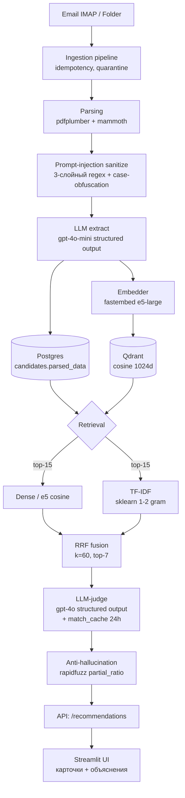

# HCB Recruiting Agent

> AI-агент для подбора кандидатов под вакансию: intake резюме с почты/папки,
> парсинг в структурированный профиль, гибридный матчинг (Dense + TF-IDF + RRF +
> LLM-judge) с anti-hallucination проверкой, объяснимые рекомендации в UI.

**Состояние:** MVP, БЛОК 0–8 закрыты (foundations → ingestion → parsing →
embeddings → matching → API → UI → research/eval). Текущие реальные метрики
на golden — см. [`reports/eval_2026-05-13.md`](./reports/eval_2026-05-13.md).

---

## Quickstart

Требования: Docker Desktop (≥24.x) с поддержкой compose v2, `make` (Git Bash
на Windows подходит). OpenAI ключ — опционально (`USE_MOCKS=True` по умолчанию).

```bash
git clone <repo> && cd ai_rec
cp .env.example .env             # USE_MOCKS=True по умолчанию
make up                          # build + lift всех сервисов
make demo                        # auto-copy 20 fixtures → /sync-mail → top-5 showcase
make eval                        # полный eval по golden (опционально, 30-40 мин)
```

`make demo` сам копирует синтетические резюме из
`tests/fixtures/golden/resumes/` в `./storage/inbox/` и триггерит ingestion —
после ~60-120 сек система готова: 10 jobs + 20 candidates + 20 Qdrant points.
Повторный `make demo` идемпотентен (пропускает ingestion).

Без `make`: `docker compose up -d --build && python scripts/demo.py`.

Сервисы:
- **API + Swagger:** http://localhost:8000/docs
- **Streamlit UI:** http://localhost:8501
- **Healthcheck:** `curl http://localhost:8000/health` → `200 ok|degraded`

---

## Архитектура



---

## Стек

| Слой | Технология | Почему |
|---|---|---|
| API | FastAPI 0.119 + uvicorn + APScheduler (lifespan) | async/await + Swagger из коробки, scheduler без отдельного контейнера |
| БД | PostgreSQL 15 + SQLAlchemy 2.0 async + asyncpg + Alembic | стандарт для async Python, миграции |
| Vector DB | Qdrant 1.11 | production-grade, cosine из коробки, named-vectors на будущее |
| Эмбеддинги | fastembed + `intfloat/multilingual-e5-large` (ONNX) | буква ТЗ (HF Sentence-BERT), multilingual ru/en, image 1.2GB вместо 3.5GB у sentence-transformers |
| Retrieval (ML baseline) | scikit-learn TfidfVectorizer (1-2 gram) | unsupervised cosine, закрывает букву ТЗ «TF-IDF + классификатор» без data leak на 60 парах |
| Fusion | Reciprocal Rank Fusion (Cormack 2009, k=60) | не требует калибровки score-шкал между dense/tfidf |
| LLM extract / judge | OpenAI gpt-4o-mini / gpt-4o (Pydantic structured output) | structured output → нет ручного `json.loads`, anti-halluc гарантия |
| Anti-hallucination | rapidfuzz partial_ratio (threshold 85) | OWASP LLM06, ловит выдуманные skills, сохраняет их в результате с пометкой LOW |
| Парсинг | pdfplumber + mammoth | MIT/BSD, без heavy deps, ~250 MB image-add |
| UI | Streamlit single-file | CLAUDE.md «не дробить», 3 tabs внутри одного файла |
| Lint/types | ruff + mypy --strict (parsing/, matching/, schemas.py) | быстрый CI, strict только на критичных модулях |
| Tests | pytest + pytest-asyncio | unit покрывает pure functions, 1 integration smoke под маркером |

---

## Реальные метрики на golden (2026-05-13)

Golden: **10 вакансий × 60 размеченных пар** (RU 6 + EN 4), filename-based labels.
Подробности — `tests/fixtures/golden/labels.json`,
[`reports/eval_2026-05-13.md`](./reports/eval_2026-05-13.md),
[`notebooks/methods_comparison.ipynb`](./notebooks/methods_comparison.ipynb).

| Method | NDCG@5 | Hit@5 | MRR | Recall@10 | p50 ms | p95 ms |
|---|---:|---:|---:|---:|---:|---:|
| dense | 0.943 | 1.000 | 1.000 | 0.947 | 613 | 14 992 |
| tfidf | 0.937 | 1.000 | 1.000 | **0.967** | **27** | **74** |
| llm | 0.926 | 1.000 | 1.000 | 0.927 | 61 354 | 68 042 |
| **hybrid** | **0.953** | 1.000 | 1.000 | 0.947 | 61 358 | 67 728 |

**RU/EN split (NDCG@5):**

| Method | en (n=4) | ru (n=6) |
|---|---:|---:|
| dense | 0.941 | 0.945 |
| tfidf | 0.881 | **0.975** |
| llm | 0.925 | 0.927 |
| hybrid | 0.925 | 0.971 |

**Наблюдения:**
- **hybrid доминирует** по NDCG@5, но всего на +1.0–1.6% над dense. Главная
  ценность hybrid — объяснения от LLM-judge + страховка на edge-cases, не точность.
- **tfidf неожиданно силён**: лучший Recall@10 (0.967) + 200× быстрее dense.
  На малом корпусе и кириллическом тексте sklearn-токенайзер очень эффективен.
- **Чистый llm хуже dense+tfidf** — на 20 кандидатах dense top-7 уже хорош,
  LLM добавляет шум (anti-halluc сработал 2 раза).
- **Latency hybrid ≈ latency llm** — bottleneck в LLM-judge (~60 сек на запрос
  под Tier 1 sequential), не в retrieval.

---

## Cost & latency (оценка)

Стоимость прогона **eval** (60 пар, 4 метода):

| Компонент | Calls | Tokens/call | Cost (gpt-4o, $5/1M in + $20/1M out) |
|---|---:|---:|---:|
| LLM extract (gpt-4o-mini, $0.15/1M in) | 20 | ~2k in / 500 out | ~$0.01 |
| LLM judge (gpt-4o) — `llm` метод | 70 | ~5k in / 400 out | ~$2.50 |
| LLM judge — `hybrid` | 70 | ~5k in / 400 out | ~$2.50 |
| Embedding e5-large (fastembed CPU) | бесплатно | — | $0 |
| TF-IDF cosine (sklearn CPU) | бесплатно | — | $0 |
| **Итого eval** | | | **~$5** |

Production-сценарий (1 новое резюме + match под 10 вакансий):
- extract: 1 × gpt-4o-mini = ~$0.0004
- embed: free (CPU); кэш в Qdrant
- match: 1 × gpt-4o-judge × 7 top кандидатов = ~$0.25
- **итого ~$0.25/резюме**

Latency (production):
- intake → parsed_data: **2-5 сек** (gpt-4o-mini structured output).
- query embedding: **~150 ms** cached, **~600 ms** cold.
- recommendations (cold cache): **60-70 сек** под Tier 1 sequential
  (Semaphore(1)). Tier 2+ можно вернуть concurrency=3-5 → ~15-20 сек.
- recommendations (warm cache): **<1 сек** (match_cache TTL 24h).

---

## Фичи и бонусы

**Базовое (ТЗ):**
- Pipeline резюме → структура (Pydantic Resume) → embedding → match → top-K с объяснением.
- TF-IDF baseline для сравнения с современным dense.
- LLM-rerank как Learning-to-Rank без labels.

**Бонусы:**
- **Hybrid retrieval (Dense + TF-IDF) с RRF fusion** — production-grade approach.
- **LLM-judge с structured output** (`beta.chat.completions.parse`) — no manual JSON parsing.
- **Anti-hallucination check** — rapidfuzz partial_ratio, OWASP LLM06.
- **Prompt-injection defense** — 3 слоя (raw → normalized → case-obfuscation),
  включая билингвальные RU/EN паттерны.
- **Quarantine pattern** — битые файлы / prompt injection / lang_unknown
  видимы рекрутёру в UI, не теряются.
- **Embedding & match cache** (Qdrant + Postgres) — keyed by `hash(text)` и
  `hash(resume_id, job_id, model_version, prompt_version)` с TTL 24h.
- **Filename-based golden labels** — переживают reset+ingest, не зависят от auto-id.
- **PII masking utility** (`src/utils/pii.py`) — email/phone маска для логов.
- **Dual-source ingestion** — IMAP (production) + FolderSource (eval/dev),
  переключение через `INGESTION_SOURCE=imap|folder|auto`.

---

## Known limitations

- **Нет аутентификации API** — `БЛОК 10.3` / production hardening.
- **Нет VLM-OCR для PDF-сканов** — `len(text) < 200` в PDF → quarantine
  `vlm_extract_failed`. Production-roadmap: локальная Qwen2.5-VL-7B
  (PII compliance) или GPT-4o Vision (быстрее, но PII уходит в OpenAI).
- **Retention не автоматизирован** — есть `DELETE /candidates/{id}` каскад,
  nightly cleanup `RESUME_RETENTION_DAYS=180` запланирован в БЛОК 10.4.
- **Audit log как roadmap** — для production-grade трекинг действий
  рекрутёра. В MVP достаточно структурированных логов с correlation_id.
- **OpenAI API для extraction/judge** — резюме покидают периметр.
  Для production обязателен OpenAI Enterprise + Zero Data Retention или
  локальная LLM (Qwen2.5-72B / Llama-3.1-70B). См. `DATA_POLICY.md`.
- **Tier 1 OpenAI** ограничивает concurrency LLM-judge на Semaphore(1).
  Под Tier 2+ (200k TPM) можно вернуть Semaphore(3-5) → 5× speedup.
- **Юнит-тесты:** 56 кейсов на pure functions (rrf, sanitize, anti_halluc,
  pii, metrics, text_extract). Coverage не измеряли — не блокирующий критерий.

---

## Live-demo сценарий

1. **Загрузить резюме** — Streamlit UI tab «Кандидаты» → drag-n-drop PDF/DOCX,
   либо положить файлы в `./storage/inbox/` и нажать «🔄 Синхронизировать
   почту» в sidebar.
2. **Выбрать вакансию** — tab «Вакансии», открыть карточку (есть 10 готовых).
3. **Top-5 кандидатов** — tab «Матчинг», выбрать вакансию + method (hybrid),
   получить ранжированный список с matched_skills, gaps, explanation, quotes.

Quarantine tab показывает битые файлы / prompt injection попытки с reasons.

---

## Data governance

Все резюме в `tests/fixtures/golden/resumes/` — **синтетические,
LLM-сгенерированы**. Реальных PII нет.

В production:
- **Маскировка PII в логах** (`mask_pii`): email → `i***@gmail.com`,
  телефон → `+7707***4567`. Применяется в `parsing/pipeline.py` и
  `ingestion/pipeline.py` для error-полей.
- **Retention 6 мес** (configurable через `RESUME_RETENTION_DAYS`).
- **Right to be forgotten:** `DELETE /candidates/{id}` каскад (БД + Qdrant + файл).
- **OpenAI ZDR** обязателен перед production-запуском (или локальная LLM).

Полная политика — [`DATA_POLICY.md`](./DATA_POLICY.md).

---

## Roadmap (production hardening)

1. **ConFit fine-tuning** multilingual-e5 на исторических hire-парах
   (NAACL 2024, +19-31% NDCG@10).
2. **Lightcast Open Skills API** для нормализации навыков (33k canonical IDs).
3. **Cross-encoder reranker** (BAAI/bge-reranker-v2-m3) между RRF и LLM-judge —
   экономит 70-90% LLM вызовов (LinkedIn JUDE methodology).
4. **Fairness audit** Wilson-Caliskan (AIES 2024, arXiv 2407.20371).
5. **BM25** как production upgrade vs TF-IDF в hybrid pipeline.
6. **Локальная VLM (Qwen2.5-VL-7B)** через Ollama/vLLM вместо GPT-4o Vision —
   PII compliance (требует GPU 16-24GB VRAM).
7. **LlamaParse / LandingAI ADE** для layout-aware парсинга (multi-column,
   таблицы).
8. **OpenAI Enterprise ZDR** контракт для production-обработки реальных PII.

---

## Research notebook

`notebooks/methods_comparison.ipynb` — сравнение 5 подходов матчинга на golden dataset
+ NER demo (spaCy) + keyword extraction comparison (YAKE / RAKE / LLM-skills) +
latency vs quality scatter. Закрывает букву ТЗ «токенизация / эмбеддинги / NER /
извлечение ключевых слов / 3+ подхода матчинга».

Запуск:

```bash
pip install -e ".[research]"
python -m spacy download ru_core_news_md
jupyter nbconvert --to notebook --execute --inplace notebooks/methods_comparison.ipynb
```

В research-deps НЕ входит OpenAI API — все cells работают offline на golden fixtures.
Production docker image research-deps не тянет.

---

## Документы

- [`ARCHITECTURE.md`](./ARCHITECTURE.md) — компонентная карта, sequence-диаграммы, 6 ADR, failure modes, security & PII boundaries, scaling characteristics.
- [`CLAUDE.md`](./CLAUDE.md) — правила написания кода и workflow.
- [`DATA_POLICY.md`](./DATA_POLICY.md) — обязательства по PII (РК 152-V).
- [`reports/eval_2026-05-13.md`](./reports/eval_2026-05-13.md) — текущие eval-числа.
- [`notebooks/methods_comparison.ipynb`](./notebooks/methods_comparison.ipynb) —
  сравнение 5 подходов матчинга + NER + keyword extraction + latency scatter.
